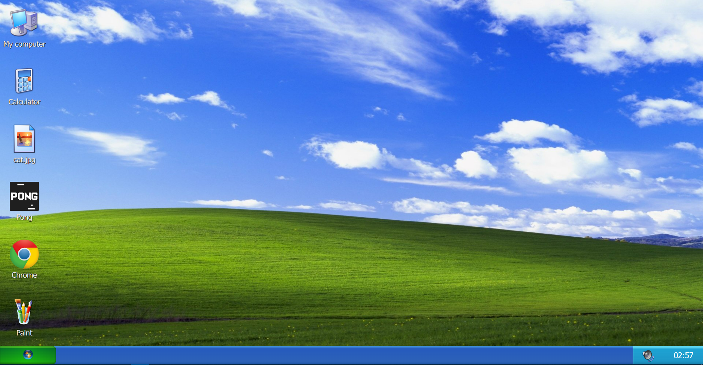
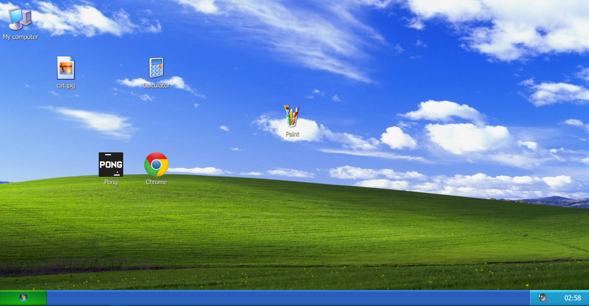
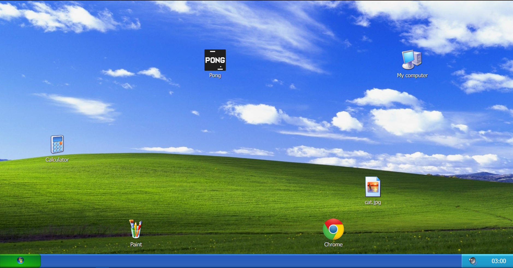
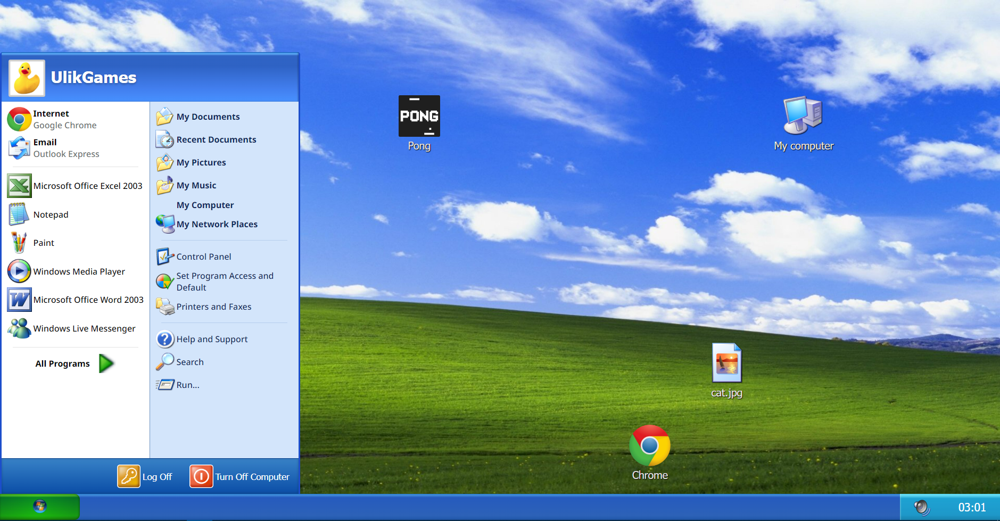
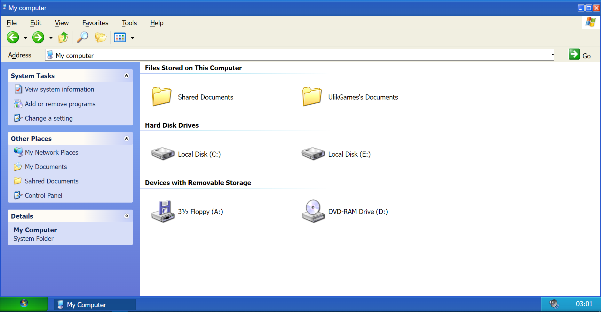
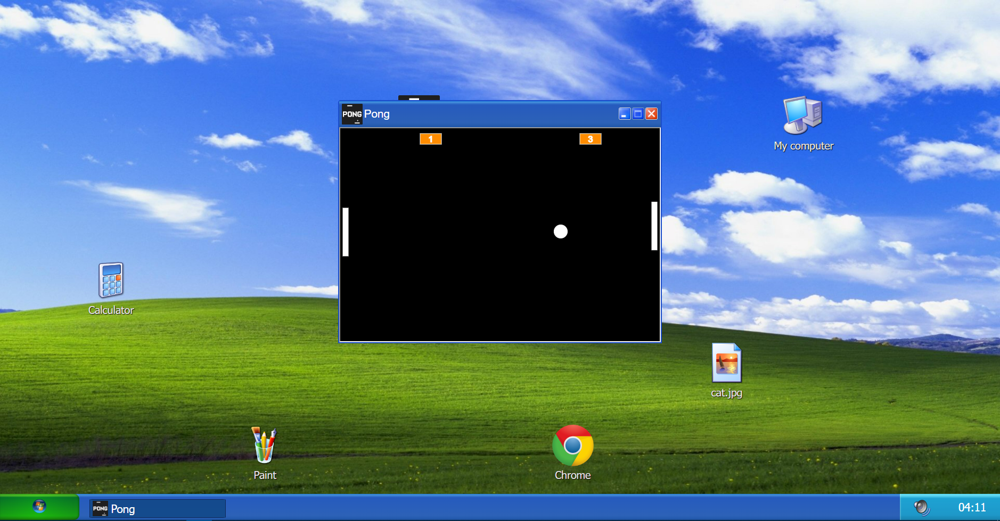
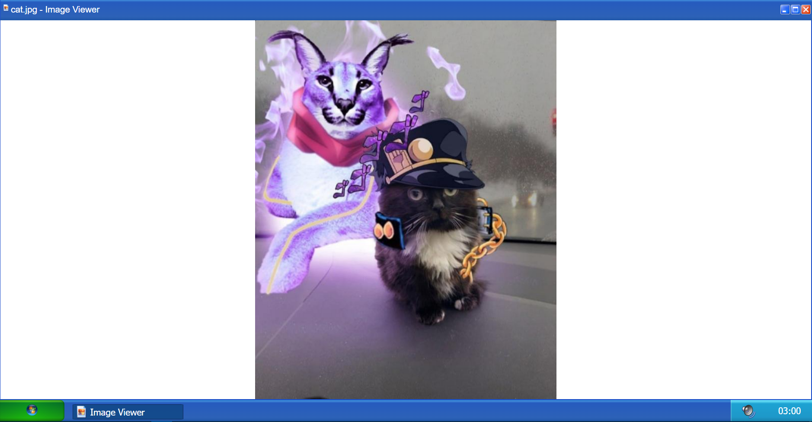
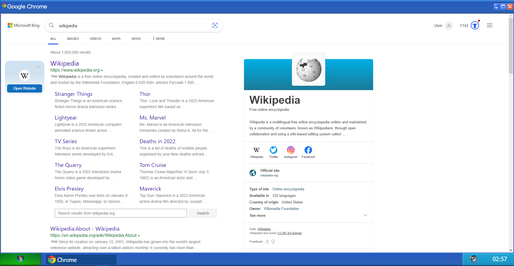
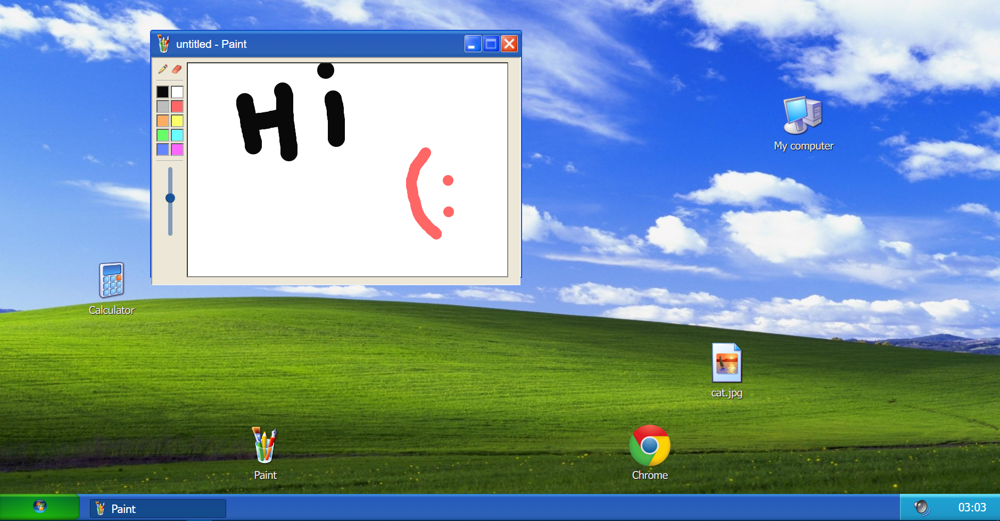
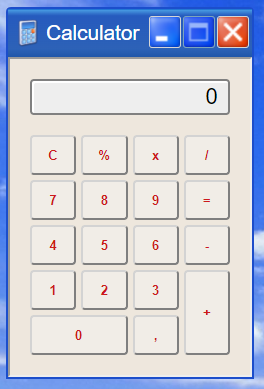

<h1 align="center">
     🖥️ <a href="https://ulikgames.github.io/windows-xp" alt="site "> Windows XP </a>
</h1>

<h3 align="center">
    🖥️ A clone of dear Windows XP! 💾
</h3>

  

  

   
 

## 💻 About the project

💻 Windows XP. 

Just Windows XP, nothing anymore

---

## ⚙️ Functionalities

- [x] Visitors can test the features of Windows XP:
  - [x] access My Computer folder
  - [x] use the Calculator
  - [x] play Pong Game
  - [x] browse through Chrome
  - [x] make drawings in Paint
  - [x] drag desktop icons (Put anywhere u want )
  - [x] open start menu
  - [x] in addition to opening an image: 
    - this open image is random, it depends on the cats API return (https://cataas.com/cat)
---

## 🎨 Layout

### Web

  
  
  
  
  
  
  
  
  
  

---

## 🚀 Access link for DEMO:

##### Link: https://ulikgames.github.io/windows-xp

---

## 🛠 Technologies

The following tools were used in building the project:

#### **Website** 

-   **[Html](https://www.w3schools.com/html/)**
-   **[CSS](https://www.w3schools.com/css/)**
-   **[Javascript](https://developer.mozilla.org/pt-BR/docs/Web/JavaScript)**

---

## 👑 Contributors

Thank <a href="https://github.com/AdilMahmudlu">AdilMahmudlu<a> for nothing. He did nothing. Just wanted to point out that he did nothing. And did I mention that he did nothing? Yeah, he was not helpful at all. Also note that he did nothing. Thank him again.
